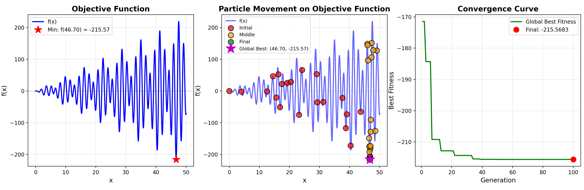
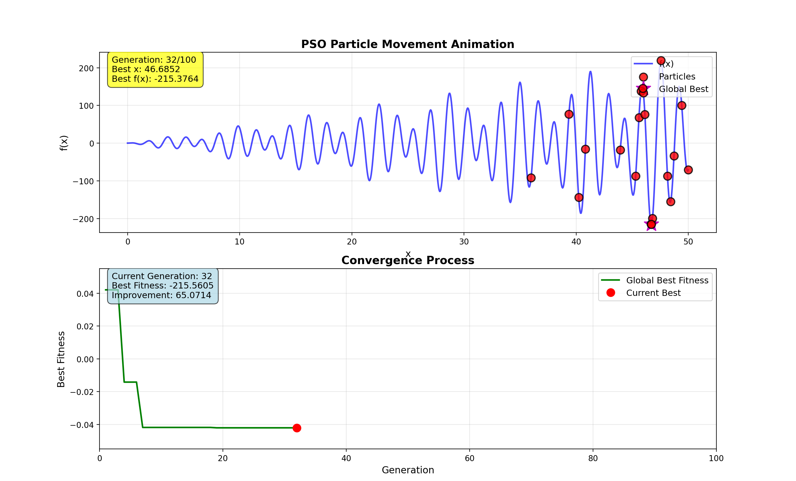
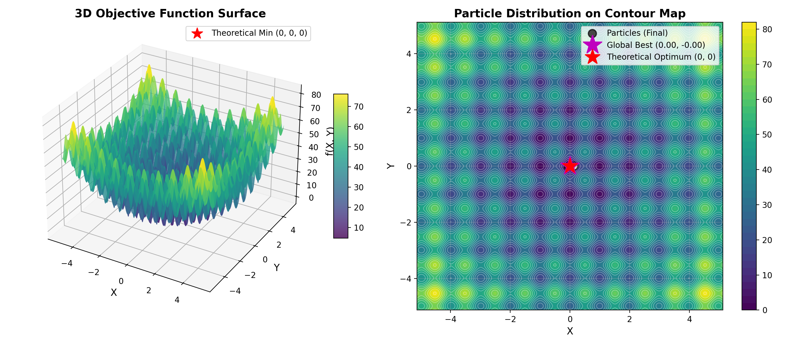
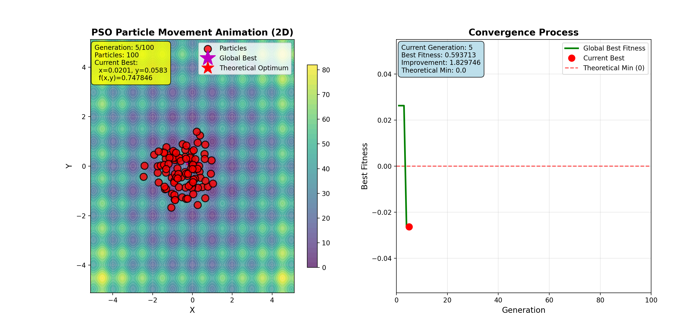
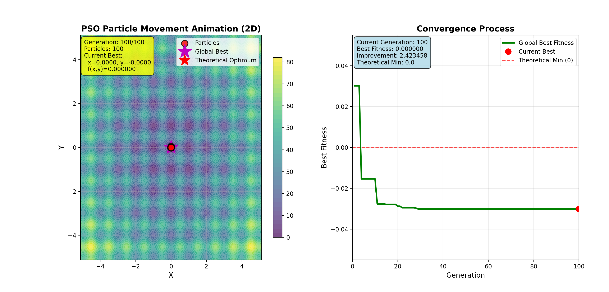
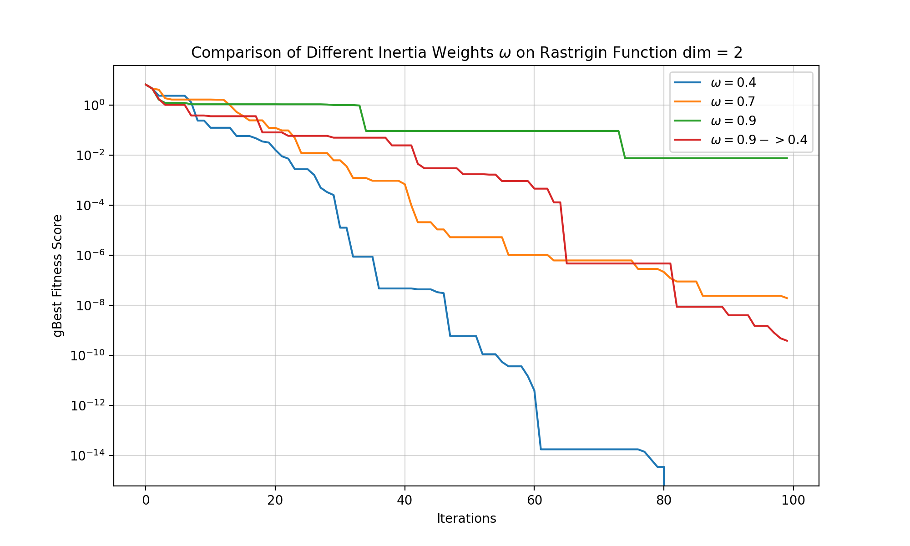

# 粒子群算法 `PSO`

## `PSO` 实现

使用 PSO 计算 f(x) = x * sin(x) * cos(2x) − 2x * sin(3x) + 3x * sin(4x)在[0,50]的最小值。

图一：数据展示

图二：中间轮次

图三：结果

使用 PSO 计算 f(x,y) = 20 + x**2 + y**2 − 10*cos(2𝜋x) − 10*cos(2𝜋𝑦)在[−5.12,5.12]的最小值

图四：数据展示

图五：中间轮次

图六：结果

测试不同惯性系数$w$、个体学习因子$c1$和社会学系因子$c2$

